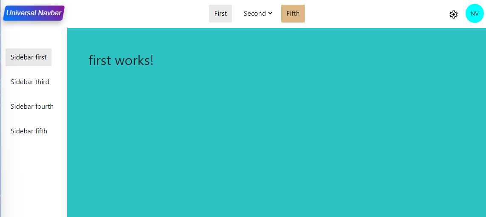

# Angular Universal Navbar

Suported Angular versions: 17.



[Click here to try it on StackBlitz](https://stackblitz.com/edit/stackblitz-starters-f3b24p)


## Usage
Add the package as a dependency to your project using:

```
npm install angular-universal-navbar

```

Add module to you app.module imports:

```typescript
import { AngularUniversalNavbarComponent, NavItem } from 'angular-universal-navbar';
...
@Component({
  selector: 'app-root',
  standalone: true,
  imports: [AngularUniversalNavbarComponent],
  ...
})
```

Define navbar items in the component(OPTIONAL) If you do not define the navbar items the navbar will not be shown:

```typescript

navItems = [
  {
    name: 'First',
    route: 'first',
    styles: {
      marginLeft: 'auto'
    },
  },
  {
    name: 'Second',
    children: [
      {
        name: 'Second First',
        route: 'second-first'
      },
      {
        name: 'Second Second',
        route: 'second-second'
      },
    ],
  },
  {
    name: 'Fifth',
    styles: {
      marginRight: 'auto'
    },
    classes: [
      'your-custom-class'
    ],
  },
  {
    component: SettingsComponent,
  },
  {
    component: UserComponent,
    componentData: {
      user: 'NV'
    }
  },
];

```

In the component template add selector and pass the navbar items.
Also, inside selector add router-outlet or any app content you wish.

```html

<angular-universal-navbar
    [navItems]="navItems"
>
    <router-outlet></router-outlet>
</angular-universal-navbar>

```
Define sidebar items in the component(OPTIONAL) If you do not define the sidebar items the sidebar will not be shown:

```typescript

sideItems: NavItem[] = [
  {
    component: LogoComponent,
    styles: {
      marginTop: '5px',
      marginBottom: '50px'
    },
  },
  {
    name: 'Sidebar first',
    route: 'first',
  },
  {
    name: 'Sidebar third',
    route: 'third'
  },
  {
    name: 'Sidebar fourth',
    route: 'fourth'
  },
  {
    name: 'Sidebar fifth',
  },
];

```

In the component template add selector and pass the sidebar items.
Also, inside selector add router-outlet or any app content you wish.

```html

<angular-universal-navbar
    [sideItems]="sideItems"
>
    <router-outlet></router-outlet>
</angular-universal-navbar>

```

Navitem is defined as follows. 

```typescript

export interface NavItem {
    name?: string;
    route?: string;
    children?: NavItem[]; 
    component?: Type<any>;
    componentData?: any;
    styles?: {[key: string]: string};
    classes?: string[];
}

```

There are three possible options: 

1.  Define only name and route which will result as default navbar item as a text field:
```typescript
    {
      name: 'Third',
      route: 'third'
    },
```

2.  Define name and its children and it will result as dropdown:
```typescript
    {
      name: 'Second',
      children: [
        {
          name: 'Second First',
          route: 'second-first'
        },
        {
          name: 'Second Second',
          route: 'second-second'
        },
      ],
    },
```

3.  Create custom component and render it inside navbar.
```typescript
    {
      component: UserComponent,
      componentData: {
        user: 'NV'
      }
    },
```
You are able to pass data to custom component, shown above which is equivalent to this: 
```html

<app-user
    user="NV"
/>
```


For all options, you are able to pass custom classes and styles:
```typescript
    {
      name: 'Fifth',
      styles: {
        marginRight: 'auto'
      },
      classes: [
        'your-custom-class'
      ],
    },
```

You can change styles directly in your global styles file (styles.css or styles.scss).

```css
.universal-navbar .active, .universal-sidebar .active{
    color: black !important;
    background-color: rgb(234, 233, 233)  !important;
}

.your-custom-class{
    background-color: burlywood;
}
```